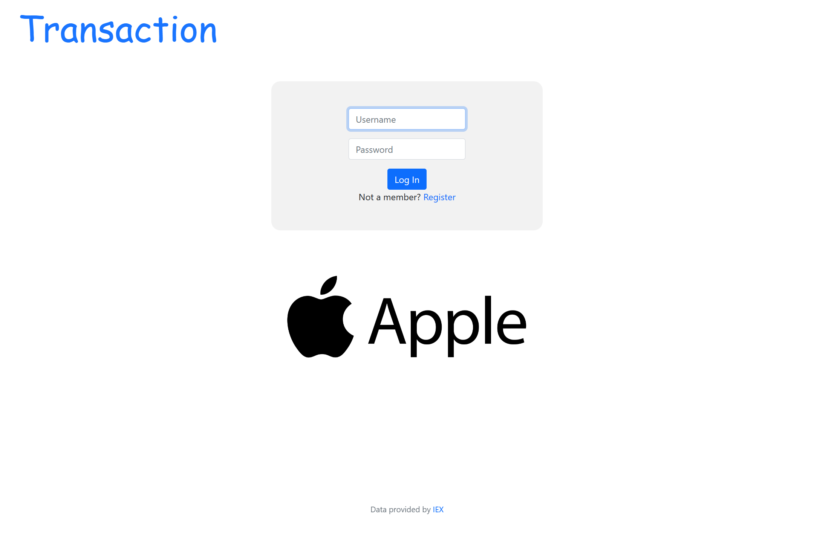
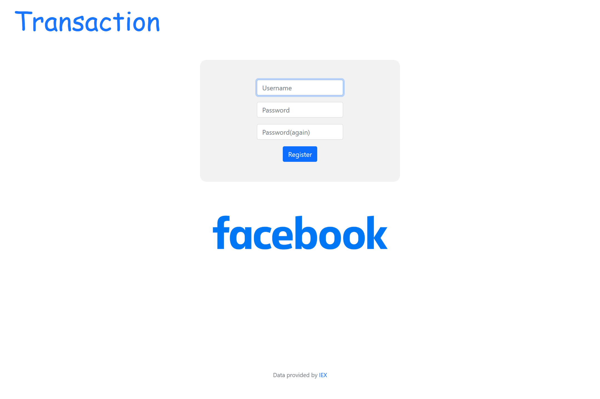
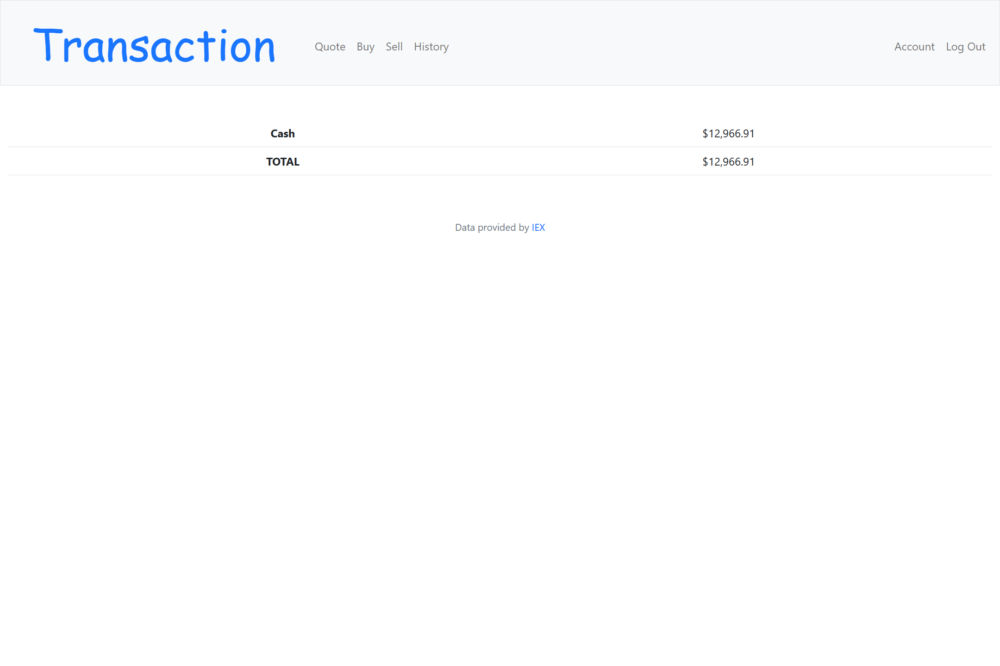
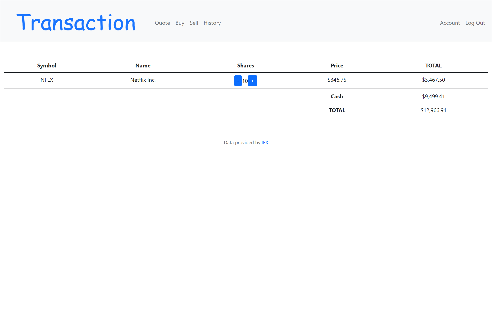

# Transaction
#### Video Demo:  <https://youtu.be/KysritLxqDI>
#### Description: In this project, i have developed a stock trading web application based on the problems set 9 of the course that allows users to buy and sell shares by providing the symbol and number of shares. Users can also check the price and name of the company by symbol, view their transaction history, and change their password and cash balance.The application is built using Python and Flask framework, with SQLite as the database management system. The user interface is developed using HTML, CSS, and Bootstrap to provide a responsive and user-friendly experience.To use the application, users need to create an account, which stores their personal information, including their transaction history, password, and cash balance. The application uses a real-time stock price API to provide the latest market data for the users.
# Technologies

- Flask
- Python
- SQLite
- HTML
- CSS
- Bootstrap 5

# Installation

- Clone / fork this repository.
- Create a virtual environment in your local Transaction directory.
- Install the required libraries that are listed in [requirements.txt](/requirements.txt).
- Sign up to [IEX Cloud](https://iexcloud.io/console/tokens) to get your own API_KEY.
- Save your API_KEY somewhere you can easily copy and paste in a format like this (replace 123456789 with your API_KEY):

```
export API_KEY=123456789
```

- Copy and paste your API_KEY to terminal:

```
$ export API_KEY=123456789
```

- Run the application:

```
$ python3 app.py
```

# Features

## Login / Register Page



Users have to create an account prior to using this application. Username must be unique and password must at least have 1 number, 1 symbol, 1 uppercase letter, 1 lowercase letter. The password stored in the database is hashed first, but for safety measures, **PLEASE DO NOT USE YOUR ACTUAL PASSWORD!**

## Index Page



Users can quote, sell, buy shares and check the history. The table show what shares users currently own and how many of them, next to each share there are two button to let users buy or sell more shares. Additionally, the cash and the TOTAL value also displayed.

## Quote Page

Users can find the price of a share and company's name by symbol.

## Buy Page

There users can buy stock via input the symbol and number of shares.

## Sell Page

There users can sell stock via input the symbol and number of shares.

## History Page

There users can check what shares and when they bought or sold.

## Account Page

There users can change their password and set the amount of cash.